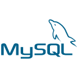
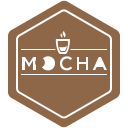
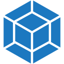

# 🖖 Live Long and Prosper

  

## 👋 Welcome to my GitHub!

I'm **Paulo Daniel Ambrosio**, a backend engineer and infrastructure specialist passionate about building scalable systems, automating complex processes, and exploring the frontiers of AI and cloud technologies.

### 🔗 Quick Links

---

## 📊 Activity & Metrics

  

  
  

### 📈 Contribution Streak

### 🏆 GitHub Trophies

### 📉 Contribution Graph

---

## 🛠️ Technical Stack

### Backend & Languages

  
  
  
  
  
  

### Frameworks & Runtime

  
  
  
  
  

### Databases & Data

  
  
  
  

### Cloud & Infrastructure

  
  
  
  
  
  

### Frontend (Secondary)

  
  
  
  
  
  

### Monitoring & Observability

  
  
  

### Tools & Testing

  
  
  

---

## 🎯 Technical Skills

| Category | Proficiency |
|----------|-------------|
| Backend Development | ⭐⭐⭐⭐⭐ |
| Infrastructure & DevOps | ⭐⭐⭐⭐⭐ |
| Cloud Architecture | ⭐⭐⭐⭐⭐ |
| Microservices | ⭐⭐⭐⭐⭐ |
| Database Design | ⭐⭐⭐⭐☆ |
| API Design (REST/GraphQL) | ⭐⭐⭐⭐☆ |
| Frontend Development | ⭐⭐⭐☆☆ |

---

## 🔬 Currently Learning & Exploring

### Active Focus Areas
- 🤖 **Autonomous AI Agents** - Building intelligent agents with LangGraph and LangChain
- ⚙️ **Infrastructure Automation** - Advanced Terraform patterns and IaC best practices
- 🦙 **Local LLM Execution** - Exploring Ollama for on-premise LLM solutions
- 📊 **MLOps & Data Pipelines** - Building scalable data processing systems
- 🏗️ **System Design** - Designing highly available, scalable distributed systems

---

### Continuous Learning
- Regularly complete courses on cloud platforms, AI/ML, and advanced backend patterns
- Active learner on Udemy, Coursera, and official cloud provider training tracks (AWS, GCP, Azure, Hauwei)

---

## 💡 Let's Connect!

I'm always interested in:
- 🤝 Collaborating on open-source projects
- 💬 Discussing scalable system architecture
- 🚀 Exploring AI/ML applications in backend systems
- 🎓 Sharing knowledge and mentoring

Feel free to reach out! Connect with me on [LinkedIn](https://www.linkedin.com/in/paulo-daniel-ambrosio/) or [email](mailto:pda.ambrosio@gmail.com).

---

## 🐍 Contribution Activity

  

  

