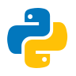

# 🖖 Live Long and Prosper

  

 

  
  

### 🛠️ Core Stack & Tools

**Cloud & Infrastructure**

  
  
  
  
  
  

**Languages & Frameworks**

  
  
  
  
  
  

**Monitoring & Data**

  
  
  

### 🚀 What I'm Up To
*   🔭 Building **Autonomous AI Agents** using LangGraph and LangChain.
*   ⚙️ Automating complex infrastructure with **Terraform** and **Python**.
*   ☁️ Exploring local LLM execution with **Ollama**.

  

